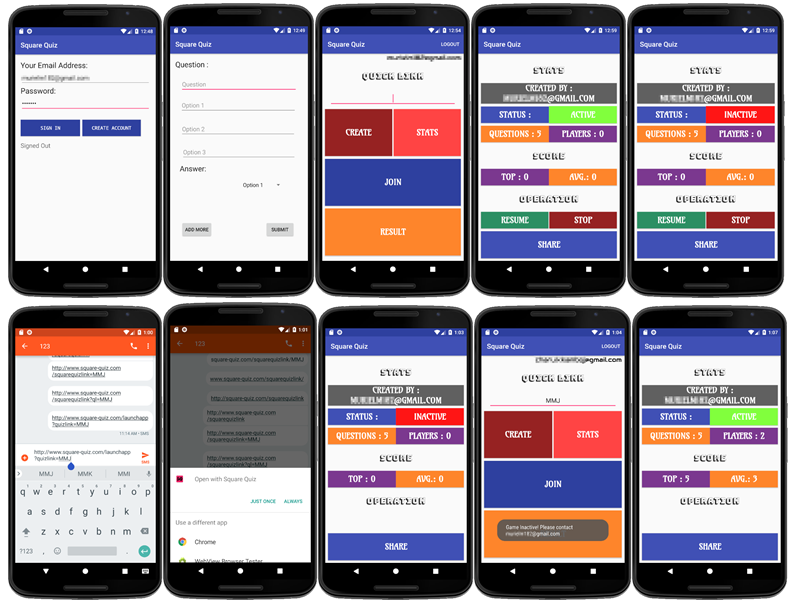

# SquareQuiz

This was an attempt to build a full-fledged android application. The objective was to build a cloud-based scalable Quiz application which had the capability of setting up questions under a quick link. On sharing the quick link, the other registered users should be able to take the quick from their devices. Also included a stats page which included admin controls like start and stop the quiz and rank/score details.

## Tech Stack
- Android
- Google Firebase API
  - Cloud Database
  - Cloud Authentication
  - Realtime Sync
  
## Core Objectives

- Learn Basics `Android Application` development
- Explore `Android Studio`
- Implementation of `Google Firebase`
- To Undersrtand `Android Architecture Components`

## Sample Screen

# 

